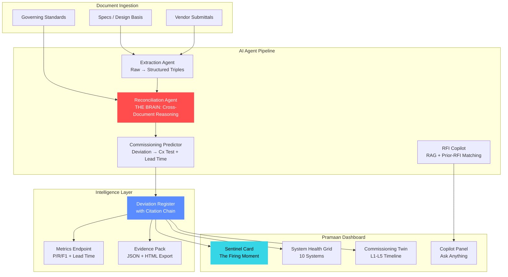

# Pramaan — Claude Code Execution Brief (v2)

## Status: Competition-Ready

All major components are implemented and tested:

- [x] P0 — Corpus generation (10 systems, 33 requirements, 6 seeded deviations)
- [x] P1 — LLM reconciliation brain with enhanced prompt + confidence scoring
- [x] P2 — Extraction agent with accuracy scoring
- [x] P3 — Commissioning twin with L1-L5 timeline + LLM fallback
- [x] P4 — Frontend: sentinel card + system health grid + Cx twin + copilot
- [x] P5 — RFI copilot with TF-IDF retrieval + prior-RFI matching
- [x] P6 — Evidence pack (JSON + printable HTML) + /metrics endpoint
- [x] Baseline eval: P/R/F1 = 1.000, Cx prediction = 1.000

## Remaining: Run with LLM key

```bash
# Set your API key and run the LLM eval
export GEMINI_API_KEY=your_key_here
python3 eval/run_eval.py --detector llm

# If recall < 1.0, the reconciliation prompt may need tuning.
# Do NOT hardcode answers — the reasoning must be real.
```

## Demo Script (90 seconds)

1. **Open** → Sentinel card fires: "UPS-02 battery autonomy 7 min vs 10 min"
2. **Lead time** → 27 weeks early. Point to the timeline strip.
3. **Citation chain** → Design basis DB-4.3 → Submittal rev B → UPTIME-TIER4
4. **System health** → 10 systems scanned, 6 findings, 4 critical
5. **Register** → Scroll the deviation table. Every row has spec vs submittal vs standard vs Cx test vs lead time.
6. **Commissioning twin** → IST-07, IST-09, IST-11 pulsing red. These tests WILL fail.
7. **Copilot** → "Has the UPS battery runtime issue come up before?" → RFI-014 cited.
8. **Export** → `/export/audit/html` → Printable compliance evidence pack.
9. **Close** → "144 weeks of total lead time. That's the difference between an email and a seven-figure schedule slip."

## Architecture Diagram (Mermaid)



## Guardrails

- Never hardcode deviation answers. The reasoning must be real; the eval proves it.
- Never reproduce copyrighted standard text — paraphrased summaries only.
- Keep the agent count at 5 and narratable. Legible beats clever.
- The lead-time number is the story. If a change buries it, revert.
