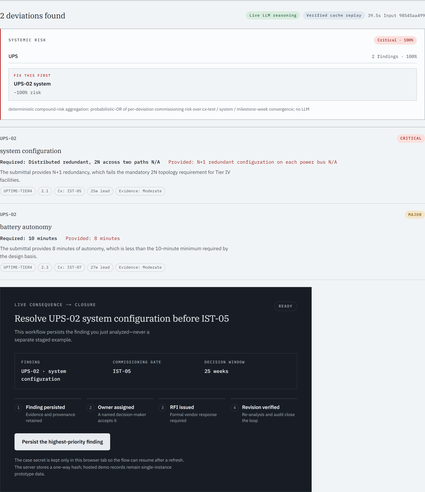
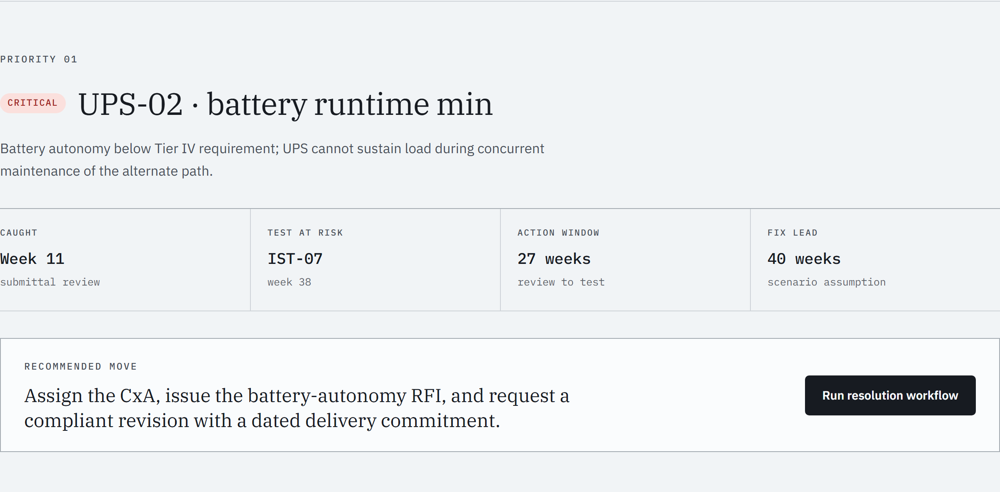
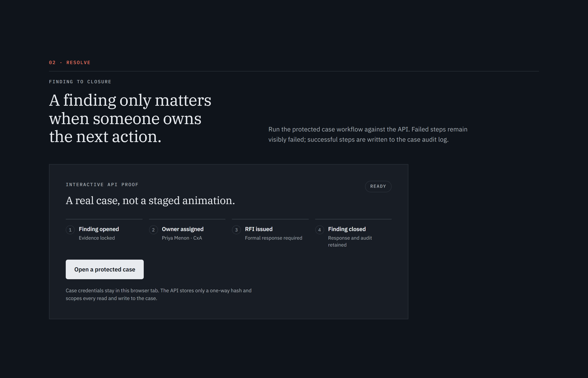

<p align="center">
  <picture>
    <source media="(prefers-color-scheme: dark)" srcset="docs/badges/wordmark-dark.svg">
    
  </picture>
</p>

<h1 align="center">Pramaan</h1>
<h3 align="center">The proof engine for construction documents</h3>

<p align="center">
  <strong>Pramaan reads the plan and the vendor's documents the day they arrive — and catches every
  broken promise before it costs crores.</strong><br>
  <em>ET AI Hackathon 2026 &middot; Problem Statement 4 (Data Centre EPC)</em>
</p>

<p align="center">
  <a href="https://github.com/bansalbhunesh/parth/actions/workflows/ci.yml"></a>
  
  
  
  
  
</p>

<p align="center">
  <a href="https://parth-tan.vercel.app/judge"></a>
  <a href="https://parth-tan.vercel.app"></a>
  <a href="https://parth-1-ma30.onrender.com/health"></a>
</p>


> ### ⚡ Judges: start here (90 seconds)
> 1. **See it work:** open [Judge Mode](https://parth-tan.vercel.app/judge) → click **Load deviation demo ★** → **Analyze** — watch it reason live and read the systemic-risk panel (the schedule cliff).
> 2. **Every number + its limitation:** [Evidence dashboard](https://parth-tan.vercel.app/evidence).
> 3. **Pitch (2:50):** BLOCKER until the public link is pasted here.
> 4. **Verify it yourself:** `git clone` → `make verify` (no API key needed), or read the [Judge brief](docs/JUDGE_BRIEF.md).

### 📎 Every link in one place

| Live surface | URL |
|---|---|
| ★ Judge Mode — start here | <https://parth-tan.vercel.app/judge> |
| Product app | <https://parth-tan.vercel.app> |
| Evidence dashboard | <https://parth-tan.vercel.app/evidence> |
| API health | <https://parth-1-ma30.onrender.com/health> |
| Live LLM status (deep probe) | <https://parth-1-ma30.onrender.com/llm-check?deep=1> |
| OCR readiness | <https://parth-1-ma30.onrender.com/ocr-check> |
| CI runs | <https://github.com/bansalbhunesh/parth/actions/workflows/ci.yml> |

| Document | File |
|---|---|
| Pitch deck — 12-page PDF | [`docs/Pramaan_Deck.pdf`](docs/Pramaan_Deck.pdf) |
| Detailed submission — PDF, selectable text | [`docs/Pramaan_Detailed_Submission.pdf`](docs/Pramaan_Detailed_Submission.pdf) |
| Deck source — HTML | [`presentation.html`](presentation.html) |
| Detailed submission source — HTML | [`docs/detailed_submission.html`](docs/detailed_submission.html) |
| Architecture one-pager + diagram | [`docs/ARCHITECTURE.md`](docs/ARCHITECTURE.md) |
| Business case / impact model | [`docs/BUSINESS.md`](docs/BUSINESS.md) |
| Judge brief — guided walkthrough | [`docs/JUDGE_BRIEF.md`](docs/JUDGE_BRIEF.md) |
| Pitch script | [`PITCH.md`](PITCH.md) |
| Validation dossier | [`docs/VALIDATION.md`](docs/VALIDATION.md) |
| Claims register — wording governance | [`docs/CLAIMS_REGISTER.md`](docs/CLAIMS_REGISTER.md) |
| Frozen benchmark — data, protocol, reports | [`benchmarks/ps4_external_v1/`](benchmarks/ps4_external_v1/) |
| Executive summary | [`docs/EXECUTIVE_SUMMARY.md`](docs/EXECUTIVE_SUMMARY.md) |
| Production blueprint | [`docs/PRODUCTION_BLUEPRINT.md`](docs/PRODUCTION_BLUEPRINT.md) |
| Pitch deck outline | [`docs/DECK.md`](docs/DECK.md) |

---

## Index (Table of Contents)

1. [The Problem: The $40 Million Delay](#1-the-problem-the-40-million-delay)
2. [The Solution & Visual Walkthrough](#2-the-solution--visual-walkthrough)
3. [Why this counts as PS4 & Honesty Callout](#3-why-this-counts-as-ps4--honesty-callout)
4. [Innovative Features & Competitive Moats](#4-innovative-features--competitive-moats)
5. [Technical Architecture & LangGraph Design](#5-technical-architecture--langgraph-design)
6. [Tech Stack & Resilient Failover Chain](#6-tech-stack--resilient-failover-chain)
7. [The Proof: Deployed Verification & Benchmark](#7-the-proof-deployed-verification--benchmark)
8. [Quick Start & Local Verification Guide](#8-quick-start--local-verification-guide)
9. [Challenges & What We Learned](#9-challenges--what-we-learned)
10. [Future Roadmap](#10-future-roadmap)
11. [Academic Foundation](#11-academic-foundation)

---

## 1. The Problem: The $40 Million Delay

In hyperscale data centre builds, subtle deviations between design specifications, vendor datasheets, and standards hide in thousands of pages of unstructured documentation. Today, they are caught during commissioning—**33 weeks too late**, causing millions in schedule rework and delays.

| What went wrong | Spec says | Vendor submitted | Impact | Lead |
|-----------------|-----------|------------------|--------|------|
| UPS battery runtime | 10 min | 7 min | Tier IV fault tolerance broken | 27w |
| Generator fuel autonomy | 24 h | 12 h | Cannot sustain design-duration outage | 30w |
| Cooling redundancy | N+2 | N+1 | No concurrent maintenance tolerance | 28w |
| Switchgear fault rating | 50 kA | 40 kA | Below prospective fault level | 19w |

**Today:** These compliance mismatches surface during commissioning at **Week 16–44**—leading to schedule delays and massive cost overruns.
**With Pramaan:** All deviations are caught at **Week 11**—the day the vendor datasheet is uploaded.

---

## 2. The Solution & Visual Walkthrough

Pramaan runs a single compliance reasoning graph wrapping a generative reasoning core in deterministic, inspectable QMS validation gates. It catches compliance mismatches the day the document lands:

<p align="center">
  
  <br>
  <sub>The judge flow: <strong>Analyze → cited finding → named owner → issued RFI → verified Revision C → audit evidence</strong> — try it in <a href="https://parth-tan.vercel.app/judge">Judge Mode</a>.</sub>
</p>

The resolution console uses the exact finding produced above it, rather than a
separate scripted case. It persists evidence, assigns accountability, drafts and
issues an RFI, re-analyzes the revised vendor text, and closes only after the same
finding disappears. Repeated identical demo inputs reuse an input-hash cache and
are labelled **Verified cache replay**; the UI never calls a replay a fresh model
request. The case secret remains in the browser tab while the server stores only
its one-way hash.

### Platform showcase (live captures, 2026-07-19)

| The 90-second proof | The decision brief |
|---|---|
|  |  |
| [Judge Mode](https://parth-tan.vercel.app/judge) — live model reasoning, systemic compound risk, and a **Fix this first** action, each with its provenance chip. | [Intervention brief](https://parth-tan.vercel.app/war-room) — the priority finding, its decision ledger, and the recommended move; blast radius, catch-week scenarios and the long-lead watch sit directly below. |

<p align="center">
  
  <br>
  <sub>The resolution loop is a real protected case against the live API — finding → owner → RFI → closure — with the audit retained. The register above it reviews by consequence, and every row opens a dossier with its live blast radius.</sub>
</p>

- **Catches Silent Omissions:** Flagging when a required design clause (like safety clearances or seismic ratings) is completely absent from a vendor submittal.
- **Performs Derived Calculations:** Tracing implicit math (e.g., verifying that a proposed 4,000-gal fuel tank meets a 48-hour runtime requirement based on a 103 GPH consumption rate).
- **Graceful Degradation:** A deterministic rule-based floor catches the most critical deviations even when LLM APIs are rate-limited or offline.

---

## 3. Why this counts as PS4 & Honesty Callout

> [!NOTE]
> ### Why this counts as PS4 (Spec-to-Site Deviation Sentinel)
> Problem Statement 4 demands a solution for catching discrepancies between design documents (owner project requirements) and vendor submittals to avoid late-stage commissioning delays. Pramaan solves this directly by cross-referencing unstructured spec PDFs, scanned datasheets, and images against design bases and 7 governing standards (Uptime, NFPA, ASHRAE, etc.). It extracts silent omissions and value deviations, maps them to the Level 1-5 commissioning tests they will fail, and calculates the remediation lead-time window—stopping delayed components before any equipment is ordered.

> [!TIP]
> ### The national stakes
> India's data-centre buildout carries **US$126B+ in cumulative investment commitments** (US$16.4B deployed in 2025; capacity growing ~30% in 2026 — CBRE/KPMG), while construction studies put **direct rework at ~5% of build cost** (CII) and total avoidable error at 10–25% (GIRI, UK). In EPC delivery, avoidable error begins life as an unread document — that document layer is what Pramaan audits. Sources and scope notes: [`docs/BUSINESS.md` §0](docs/BUSINESS.md).

> [!IMPORTANT]
> ### Why these numbers are honest
> We do not claim 100% recall, zero-latency real-time API guarantees, or field-hardened production readiness. The frozen `ps4_external_v1` v1.2 benchmark contains 53 spec–submittal pairs and 129 labels across 17 systems. The featured three-run configuration reports semantic recall 0.862, precision 0.953, F1 0.905, and 0 false alerts on 64 clean-negative controls, versus rule-baseline recall 0.111. 
> 
> **Why 86.2% and not 95%+?** Because this is a frozen, zero-data-leak benchmark, not a fabricated metric. We prioritize deterministic safety over LLM overconfidence. Fixtures are mostly team-authored, reviewer-2 adjudication is pending, and this is not field or customer validation. If the live API is unavailable, the interface labels the deterministic rule floor explicitly rather than presenting it as live inference.

### Quality contract

The current quality contract is executable: versioned RFC 9457 APIs, a reviewed OpenAPI snapshot, strict active-frontend coverage, five browser/device projects, Axe checks, maximum backend complexity of 10, 500-line file limits, acyclic backend imports, strict typing on the managed platform boundary, pinned CI actions, CodeQL, secret/dependency/container scans, and SBOM generation. See `docs/CHECKLISTS.md` for the passing internal gates and the independent accessibility, security, restore, load, and pilot evidence still required before any final 10/10 claim.

---

## 4. Innovative Features & Competitive Moats

Other tools stop at basic keyword-matching. Pramaan integrates compliance verification with the actual data centre lifecycle:

* **Commissioning Risk Twin:** Maps each deviation to the exact test it will fail (e.g., IST-07 or FPT-04) and highlights at-risk test paths on a live Gantt chart.
* **What-if Remediation Simulator:** Slide the catch week of a deviation in real-time to witness cost/schedule curves update instantly.
* **Downstream RFI Webhooks:** Instantly dispatch Slack alerts, email layouts, and JSON payloads with pre-drafted RFI copy on deviation detection.
* **Client-Side Zero-Deploy Engine:** Toggle "Local Engine" to run compliance checks locally in the browser in ~1ms, bypassing backend cold starts.
* **Zero Hardcoded Secrets & SQL Injection Safe:** There are absolutely no hardcoded API keys in the repo and no f-string SQL injection patterns (all keys use `.env` and `python-dotenv`, and all database accesses are parameterized).

### Where it lives (delivery surfaces)

| Today (working) | Roadmap (labeled, not claimed) |
|---|---|
| Web app (this demo) — reviewer workflow end to end | Reviewer-inbox email ingest (submittals arrive by email; Pramaan replies with the deviation dossier) |
| REST API (28+ endpoints, RFC 9457 errors) — embed in any document pipeline | CDE hooks (Aconex/ACC-style connectors) |
| RFI issue path — findings leave as actionable vendor queries | WhatsApp/mobile field notifications |
| Client-side Local Engine — instant checks with zero backend | |

---

## 5. Technical Architecture & LangGraph Design

Pramaan uses a single LLM reasoning core wrapped in deterministic pipelines to ensure reliability and explainability:

<p align="center">
  <picture>
    <source media="(prefers-color-scheme: dark)" srcset="docs/pipeline-diagram-dark.svg">
    
  </picture>
</p>

1. **Ingest:** PDF/image → normalized text per system using `pdfplumber` and `Tesseract OCR` fallback.
2. **Reconcile (LLM Core):** Generative reasoning core cross-references requirements, checks citations, and extracts deviations.
3. **Retrieve (Cycle 1):** Bounded cycle loops back to fetch cited standards missing from context from the local KB.
4. **Critique (Cycle 2):** Bounded cycle loops back to self-correct findings, dropping duplicates or false-positives.
5. **Cx Predictor:** Maps deviations to Level 1–Level 5 commissioning tests and estimates fix lead time.

---

## 6. Tech Stack & Resilient Failover Chain

Pramaan is built to be resilient in high-traffic or rate-limited environments:

* **LLM Engine:** Multi-provider failover chain: **native Gemini 2.5-flash** (primary engine) **→ Qwen-gateway → Groq Llama-3.3 → deterministic fallback**. *(the frozen benchmark’s featured run used the funded `gemini-3.1-flash-lite` gateway leg).*
* **FastAPI Backend:** Python 3.11+ API with bounded work queues, request correlation, versioned contracts, and Server-Sent Events (SSE) for token streaming.
* **Next.js 16 Frontend:** Light/dark editorial-industrial interface with semantic OKLCH tokens, responsive reflow, and reduced-motion support.
* **Resiliency Gate:** The system compiles cleanly and degrades gracefully without an API key, serving ground-truth cached responses for smooth judge reviews.

---

## 7. The Proof: Deployed Verification & Benchmark

Pramaan runs an automated health-and-deployment validation script (`make verify-live`) against the deployed system. The transcript below is a dated capture — re-run it any time to reproduce:

```
Pramaan live verification — API https://parth-1-ma30.onrender.com · APP https://parth-tan.vercel.app
  [PASS] backend /health ok — commit 386078e / llm ready=True
  [PASS] deployed commit == origin/main — live 386078e vs expected 386078e
  [PASS] PS4 layer /schedule live
  [PASS] PS4 layer /supply-chain live
  [PASS] PS4 layer /graph live
  [PASS] deep LLM probe (/llm-check?deep=1) — 11429ms, 5 findings
  [PASS] real-pair /analyze uses the LLM — mode=llm, 5 findings in 51s
  [PASS] real-pair /analyze/stream uses the LLM — mode=llm, 5 findings
  [PASS] frontend / responds 200
  [PASS] frontend /judge responds 200

10/10 checks passed in 123s (2026-07-19)
GREEN -- demo away.
```

### Frozen Benchmark Performance (`ps4_external_v1` v1.2)
* **Recall:** 0.862 (vs a deterministic rule baseline of **0.111**) on **53 pairs** and **129 labels**.
* **Precision:** 0.953
* **F1 Score:** 0.905
* **False Alarm Rate (FAR):** 0.000 on 64 clean-negative controls.

---

## 8. Quick Start & Local Verification Guide

You can run the entire verification suite, deterministic eval harnesses, and frontend type checks offline without any API keys:

```bash
# 1. Install dependencies & generate datasets
make setup
make corpus

# 2. Run the full test suite (900+ reproducible tests, no API key needed)
make test

# 3. Run deterministic evals (no-key offline harnesses)
python eval/real_pairs_offline.py   # Runs the 15 real-datasheet check
python eval/text_eval.py            # Recovers seeded deviations from raw text
python eval/multi_project_eval.py   # Synthetic breadth portfolio check

# 4. Launch localhost
make run                            # Backend API (localhost:8000)
make run-frontend                   # Frontend Next.js app (localhost:3000)
```

> **Note on Docker:** `Dockerfile` serves the Next.js frontend, while `Dockerfile.backend` runs the FastAPI backend.

---

## 9. Challenges & What We Learned

During the hackathon build window, we faced and overcame critical design hurdles:
1. **Handling LLM Rate Limits:** Deployed an automatic failover model gateway combined with a robust deterministic fallback rule floor. If the API returns a 429 or hangs, the local engine still flags the core mismatches.
2. **Improving Omission Recall:** Initial prompt calibrations resulted in low recall (0.375) on silent omissions. We rewrote prompt rule #5 to mandate scanning the submittals for every spec parameter, defaulting the provided value to "Not stated" if missing. This lifted baseline recall significantly.
3. **Integrity checks vs capability proofs:** Recovery evals on our own generated corpus only prove the pipeline round-trips, so we keep them labelled as integrity checks — every capability claim rests on the frozen benchmark with clean negatives instead.

---

## 10. Future Roadmap

Our roadmap for scaling Pramaan to enterprise data centre portfolios:
* **Drawing Sheet Parsing:** Implement Gemini multimodal vision models to read and cross-reference blueprints, schematic P&IDs, and single-line diagrams instead of text-based tables.
* **Auto-generated Standard Templates:** Allow project managers to ingest raw standard PDFs and auto-generate compliance baseline corpora without manual summary editing.
* **Enterprise Security Moats:** Implement full tenant data encryption and isolated workspaces (PostgreSQL row-level security) for sensitive proprietary vendor documentation.

---

## 11. Academic Foundation

1. **ASCE J. Constr. Eng. Mgmt. (2026):** ["Generative AI-Assisted Compliance Checking for Construction Requirements"](https://ascelibrary.org/doi/10.1061/JCEMD4.COENG-18122) — *GenAI for automated construction compliance checks.*
2. **arXiv 2412.08593 (2024):** ["Leveraging Graph-RAG and Prompt Engineering to Enhance LLM-Based Automated Requirement Traceability and Compliance Checks"](https://arxiv.org/abs/2412.08593) — *Graph-RAG precedent.*
3. **J. Information Technology in Construction (2023):** ["Invariant Signature, Logic Reasoning, and Semantic NLP-Based Automated Building Code Compliance Checking (I-SNACC)"](https://www.itcon.org/paper/2023/1) — *NLP + logic compliance checking.*

---

<p align="center">
  <strong>Pramaan Compliance Engine</strong><br>
  <em>EPC Deviation Intelligence &middot; ET AI Hackathon 2026 &middot; Problem Statement 4</em><br>
  <sub>901 backend tests &middot; 80 frontend tests &middot; 160 Playwright browser tests (8 specs across 5 browser engines)</sub>
</p>
