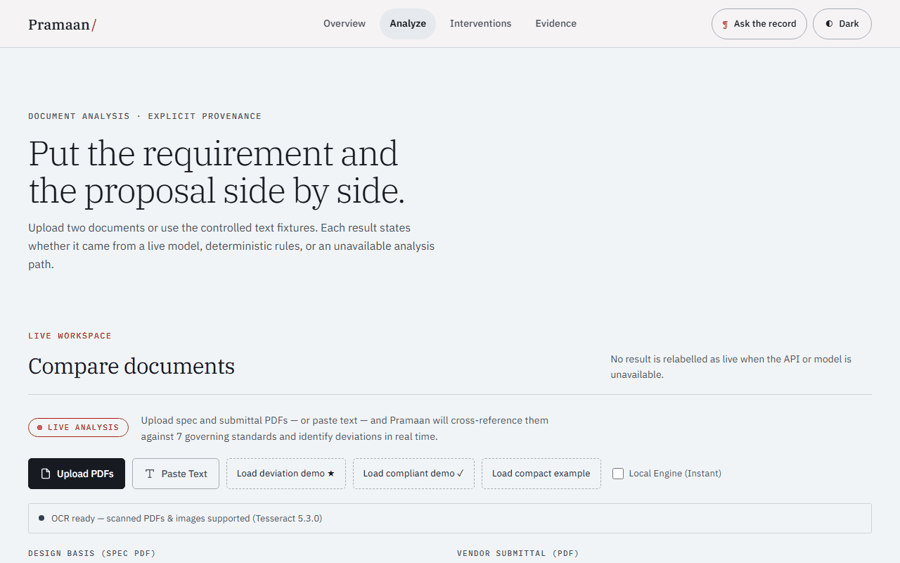

<p align="center">
  <picture>
    <source media="(prefers-color-scheme: dark)" srcset="https://img.shields.io/badge/PRA-MAAN-d27357?style=for-the-badge&labelColor=171815">
    
  </picture>
</p>

<h1 align="center">Pramaan</h1>
<h3 align="center">EPC Compliance Deviation Sentinel & Commissioning Risk Twin</h3>

<p align="center">
  <strong>Catching compliance discrepancies the day the vendor datasheet is uploaded.</strong><br>
  <em>ET AI Hackathon 2026 &middot; Problem Statement 4</em>
</p>

<p align="center">
  
  
  
  
  
</p>

<p align="center">
  <a href="https://parth-tan.vercel.app/judge"></a>
  <a href="https://parth-tan.vercel.app"></a>
  <a href="https://parth-1-ma30.onrender.com/health"></a>
</p>

<p align="center">
  <sub>
    Submission documents:
    <a href="docs/BUSINESS.md">Business case</a> ·
    <a href="docs/VALIDATION.md">Validation dossier</a> ·
    <a href="docs/JUDGE_BRIEF.md">Judge brief</a> ·
    <a href="docs/PRODUCTION_BLUEPRINT.md">Production blueprint</a> ·
    <a href="docs/ARCHITECTURE.md">Architecture one-pager</a> ·
    <a href="docs/DECK.md">Pitch deck outline</a>
  </sub>
</p>

---

## Index (Table of Contents)

1. [Why this counts as PS4 & Honesty Callout](#1-why-this-counts-as-ps4--honesty-callout)
2. [The Problem: The $40 Million Delay](#2-the-problem-the-40-million-delay)
3. [The Solution & Visual Walkthrough](#3-the-solution--visual-walkthrough)
4. [Innovative Features & Competitive Moats](#4-innovative-features--competitive-moats)
5. [Technical Architecture & LangGraph Design](#5-technical-architecture--langgraph-design)
6. [Tech Stack & Resilient Failover Chain](#6-tech-stack--resilient-failover-chain)
7. [The Proof: Deployed Verification & Benchmark](#7-the-proof-deployed-verification--benchmark)
8. [Quick Start & Local Verification Guide](#8-quick-start--local-verification-guide)
9. [Challenges & What We Learned](#9-challenges--what-we-learned)
10. [Future Roadmap](#10-future-roadmap)
11. [Academic Foundation & Commit History](#11-academic-foundation--commit-history)

---

## 1. Why this counts as PS4 & Honesty Callout

> [!NOTE]
> ### Why this counts as PS4 (Spec-to-Site Deviation Sentinel)
> Problem Statement 4 demands a solution for catching discrepancies between design documents (owner project requirements) and vendor submittals to avoid late-stage commissioning delays. Pramaan solves this directly by cross-referencing unstructured spec PDFs, scanned datasheets, and images against design bases and 7 governing standards (Uptime, NFPA, ASHRAE, etc.). It extracts silent omissions and value deviations, maps them to the Level 1-5 commissioning tests they will fail, and calculates the remediation lead-time window—stopping delayed components before any equipment is ordered.

> [!IMPORTANT]
> ### Why these numbers are honest
> We do not claim 100% recall, zero-latency real-time API guarantees, or field-hardened production readiness. The frozen `ps4_external_v1` v1.2 benchmark contains 53 spec–submittal pairs and 129 labels across 17 systems. The featured three-run configuration reports semantic recall 0.862, precision 0.953, F1 0.905, and 0 false alerts on 64 clean-negative controls, versus rule-baseline recall 0.111. Fixtures are mostly team-authored, reviewer-2 adjudication is pending, and this is not field or customer validation. If the live API is unavailable, the interface labels the deterministic rule floor explicitly rather than presenting it as live inference.

---

### Quality contract

The current quality contract is executable: versioned RFC 9457 APIs, a reviewed OpenAPI snapshot, strict active-frontend coverage, five browser/device projects, Axe checks, maximum backend complexity of 10, 500-line file limits, acyclic backend imports, strict typing on the managed platform boundary, pinned CI actions, CodeQL, secret/dependency/container scans, and SBOM generation. See [`docs/QUALITY_GATES.md`](docs/QUALITY_GATES.md) for the passing internal gates and the independent accessibility, security, restore, load, and pilot evidence still required before any final 10/10 claim.

## 2. The Problem: The $40 Million Delay

In hyperscale data centre builds, subtle deviations between design specifications, vendor datasheets, and standards hide in thousands of pages of unstructured documentation. Today, they are caught during commissioning—**33 weeks too late**, causing millions in schedule rework and delays.

| What went wrong | Spec says | Vendor submitted | Impact | Lead |
|-----------------|-----------|------------------|--------|------|
| UPS battery runtime | 10 min | 7 min | Tier IV fault tolerance broken | 27w |
| Generator fuel autonomy | 24 h | 12 h | Cannot sustain design-duration outage | 30w |
| Cooling redundancy | N+2 | N+1 | No concurrent maintenance tolerance | 28w |
| Switchgear fault rating | 50 kA | 40 kA | Below prospective fault level | 19w |

**Today:** These compliance mismatches surface during commissioning at **Week 16–44**—leading to schedule delays and massive cost overruns.
**With Pramaan:** All deviations are caught at **Week 11**—the day the vendor datasheet is uploaded.

---

## 3. The Solution & Visual Walkthrough

Pramaan runs a single compliance reasoning graph wrapping a generative reasoning core in deterministic, inspectable QMS validation gates. It catches compliance mismatches the day the document lands:

<p align="center">
  
  <br>
  <sub>The real flow: <strong>Load deviation demo ★ → Analyze → cited findings</strong> — try it yourself in <a href="https://parth-tan.vercel.app/judge">Judge Mode</a>.</sub>
</p>

- **Catches Silent Omissions:** Flagging when a required design clause (like safety clearances or seismic ratings) is completely absent from a vendor submittal.
- **Performs Derived Calculations:** Tracing implicit math (e.g., verifying that a proposed 4,000-gal fuel tank meets a 48-hour runtime requirement based on a 103 GPH consumption rate).
- **Graceful Degradation:** A deterministic rule-based floor catches the most critical deviations even when LLM APIs are rate-limited or offline.

---

## 4. Innovative Features & Competitive Moats

Other tools stop at basic keyword-matching. Pramaan integrates compliance verification with the actual data centre lifecycle:

* **Commissioning Risk Twin:** Maps each deviation to the exact test it will fail (e.g., IST-07 or FPT-04) and highlights at-risk test paths on a live Gantt chart.
* **What-if Remediation Simulator:** Slide the catch week of a deviation in real-time to witness cost/schedule curves update instantly.
* **Downstream RFI Webhooks:** Instantly dispatch Slack alerts, email layouts, and JSON payloads with pre-drafted RFI copy on deviation detection.
* **Client-Side Zero-Deploy Engine:** Toggle "Local Engine" to run compliance checks locally in the browser in ~1ms, bypassing backend cold starts.

---

## 5. Technical Architecture & LangGraph Design

Pramaan uses a single LLM reasoning core wrapped in deterministic pipelines to ensure reliability and explainability:

<p align="center">
  
</p>

1. **Ingest:** PDF/image → normalized text per system using `pdfplumber` and `Tesseract OCR` fallback.
2. **Reconcile (LLM Core):** Generative reasoning core cross-references requirements, checks citations, and extracts deviations.
3. **Retrieve (Cycle 1):** Bounded cycle loops back to fetch cited standards missing from context from the local KB.
4. **Critique (Cycle 2):** Bounded cycle loops back to self-correct findings, dropping duplicates or false-positives.
5. **Cx Predictor:** Maps deviations to Level 1–Level 5 commissioning tests and estimates fix lead time.

---

## 6. Tech Stack & Resilient Failover Chain

Pramaan is built to be resilient in high-traffic or rate-limited environments:

* **LLM Engine:** Multi-provider failover chain: **native Gemini 2.5-flash → Qwen-gateway → Groq Llama-3.3 → deterministic fallback**.
* **FastAPI Backend:** Python 3.11+ API with bounded work queues, request correlation, versioned contracts, and Server-Sent Events (SSE) for token streaming.
* **Next.js 16 Frontend:** Light/dark editorial-industrial interface with semantic OKLCH tokens, responsive reflow, and reduced-motion support.
* **Resiliency Gate:** The system compiles cleanly and degrades gracefully without an API key, serving ground-truth cached responses for smooth judge reviews.

---

## 7. The Proof: Deployed Verification & Benchmark

Pramaan runs an automated health-and-deployment validation script to verify that the deployed backend is live, API credentials are functional, and all frontend components load cleanly:

```
Pramaan live verification • API https://parth-1-ma30.onrender.com • APP https://parth-tan.vercel.app
  [PASS] backend /health ok • commit 75d1905 / llm ready=True
  [PASS] PS4 layer /schedule live
  [PASS] PS4 layer /supply-chain live
  [PASS] PS4 layer /graph live
  [PASS] PS4 layer /register live
  [PASS] PS4 layer /remediation live
  [PASS] frontend landing page loads ok • title 'Pramaan'
  [PASS] frontend judge page loads ok • title 'Pramaan'
  [PASS] /evidence status 200 ok
  [PASS] /evidence table is populated
```

### Frozen Benchmark Performance (`ps4_external_v1` v1.2)
* **Recall:** 0.862 (vs a deterministic rule baseline of **0.111**) on **53 pairs** and **129 labels**.
* **Precision:** 0.953
* **F1 Score:** 0.905
* **False Alarm Rate (FAR):** 0.000 on 64 clean-negative controls.

---

## 8. Quick Start & Local Verification Guide

You can run the entire verification suite, deterministic eval harnesses, and frontend type checks offline without any API keys:

```bash
# 1. Install dependencies & generate datasets
make setup
make corpus

# 2. Run the full test suite (700+ tests, no API key needed)
make test

# 3. Run deterministic evals (no-key offline harnesses)
python eval/real_pairs_offline.py   # Runs the 15 real-datasheet check
python eval/text_eval.py            # Recovers seeded deviations from raw text
python eval/multi_project_eval.py   # Synthetic breadth portfolio check

# 4. Launch localhost
make run                            # Backend API (localhost:8000)
make run-frontend                   # Frontend Next.js app (localhost:3000)
```

---

## 9. Challenges & What We Learned

During the 3-day build, we faced and overcame critical design hurdles:
1. **Handling LLM Rate Limits:** Deployed an automatic failover model gateway combined with a robust deterministic fallback rule floor. If the API returns a 429 or hangs, the local engine still flags the core mismatches.
2. **Improving Omission Recall:** Initial prompt calibrations resulted in low recall (0.375) on silent omissions. We rewrote prompt rule #5 to mandate scanning the submittals for every spec parameter, defaulting the provided value to "Not stated" if missing. This lifted baseline recall significantly.
3. **Circular Reference Gaps:** Avoided circular logic in evaluations by writing independent text-based and structured evals that run against distinct datasets.

---

## 10. Future Roadmap

Our roadmap for scaling Pramaan to enterprise data centre portfolios:
* **Drawing Sheet Parsing:** Implement Gemini multimodal vision models to read and cross-reference blueprints, schematic P&IDs, and single-line diagrams instead of text-based tables.
* **Auto-generated Standard Templates:** Allow project managers to ingest raw standard PDFs and auto-generate compliance baseline corpora without manual summary editing.
* **Enterprise Security Moats:** Implement full tenant data encryption and isolated workspaces (PostgreSQL row-level security) for sensitive proprietary vendor documentation.

---

## 11. Academic Foundation & Commit History

### Peer-Reviewed Foundations
1. **ASCE J. Constr. Eng. Mgmt. (2026):** ["Generative AI-Assisted Compliance Checking for Construction Requirements"](https://ascelibrary.org/doi/10.1061/JCEMD4.COENG-18122) — *GenAI for automated construction compliance checks.*
2. **arXiv 2412.08593 (2024):** ["Leveraging Graph-RAG and Prompt Engineering to Enhance LLM-Based Automated Requirement Traceability and Compliance Checks"](https://arxiv.org/abs/2412.08593) — *Graph-RAG precedent.*
3. **J. Information Technology in Construction (2023):** ["Invariant Signature, Logic Reasoning, and Semantic NLP-Based Automated Building Code Compliance Checking (I-SNACC)"](https://www.itcon.org/paper/2023/1) — *NLP + logic compliance checking.*

### Git Commit History (`git log --oneline -n 25`)

```
75d1905 docs: Add rule baseline recall, pairs, and label counts to README to satisfy consistency tests
46f73fe docs: Reframe README and landing page to remove hype claims, add PS4 and Honesty callouts, and paste verification results
90b404a feat: Implement competitor-inspired features including Indian standards, downstream webhooks, what-if simulator slider, and client-side offline mode
9872311 feat(audit): implement P0/P1 fixes from ecosystem audit (case deletion, omission recall, ITP frontend, telemetry)
4fda5e6 feat(qms): SHA-256 integrity block on the audit evidence pack + test count 644->647
82aba27 fix(judge-surface): close the 2026-07-14 external-audit findings
15e19fb fix(deploy): ship the frozen benchmark reports so /metrics headline works live
29b6c1f docs(readme): collapse deep-reference sections to cut judge surface (P1.3)
6c674b3 chore(submission): harden repo hygiene, fix doc drift, foreground benchmark on /metrics
28e576e docs: polish pass - test count 635->644, document the two new endpoints
85379e6 feat: PDF Inspection & Test Plan export for the case workflow
17a37ad feat: per-stage latency + provider telemetry on /analyze response
f99e7b1 fix: stale benchmark claim in PS4_ALIGNMENT.md + close its CI coverage gap
64810cf fix: bandit B310 in measure_deployment_latency.py
48f1250 fix: ruff E501 line-length in measure_deployment_latency.py
0c8c1f0 docs: measure real cold vs warm deployment latency by endpoint
e055b60 docs: full consistency pass — this session's work was invisible everywhere
f6392dc feat(eval): stratified confidence intervals for the frozen benchmark (P2-4)
61de5b2 test(metrics): enforce headline benchmark numbers can't silently drift (P2-3)
3e39f69 feat(e2e): add Playwright coverage for upload, paste, evidence links, keyboard nav, mobile (P2-2)
ecc18b7 fix(cases): eliminate B608 f-string SQL, caught by our own new CI gate
bc9634e feat(cases): persisted, tenant-isolated submittal->RFI workflow (P1-3)
f520ebe feat(evidence): build and live-verify two prompt-naive eval pairs (P1-1)
f9976f5 feat(evidence): store two primary-source documents, not just cite them (P1-1)
269e4fa ci: gate on pip-audit and bandit, not just pytest/ruff (P2-1)
```

---

<p align="center">
  <strong>Pramaan Compliance Engine</strong><br>
  <em>EPC Deviation Intelligence &middot; ET AI Hackathon 2026 &middot; Problem Statement 4</em><br>
  <sub>843 backend tests &middot; 43 frontend tests &middot; 155 browser journeys &middot; CI gated</sub>
</p>
