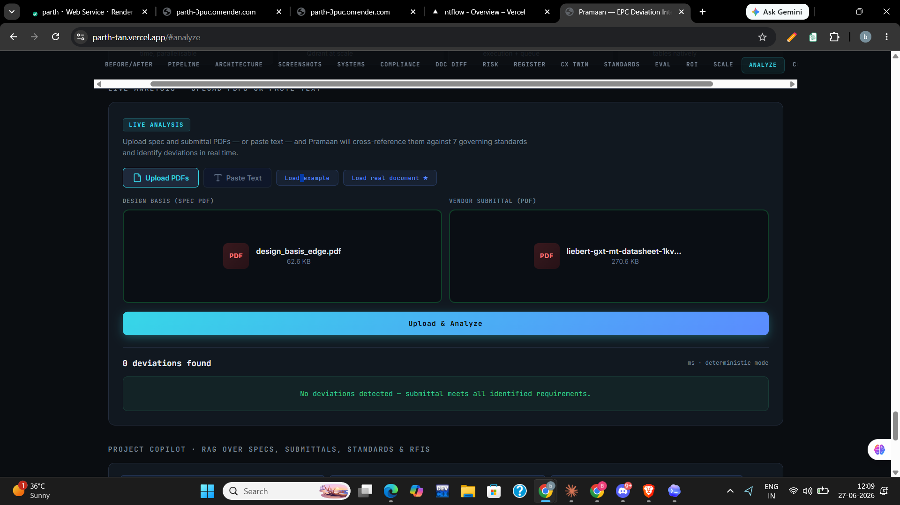
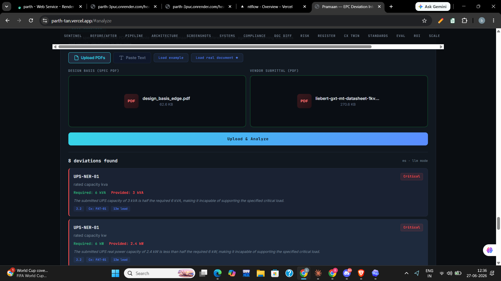
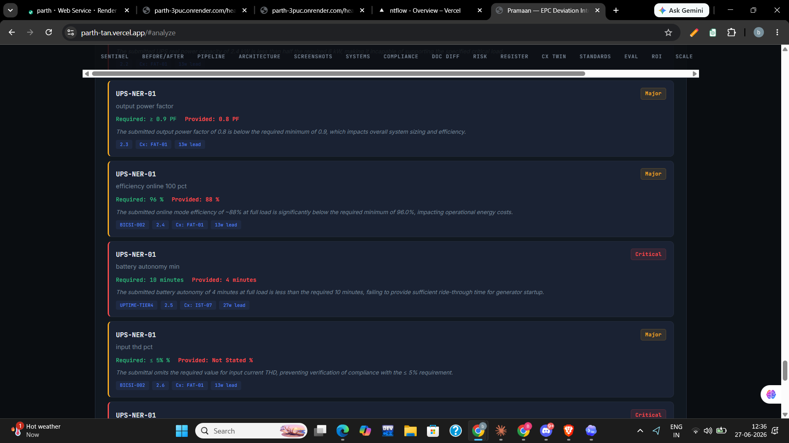
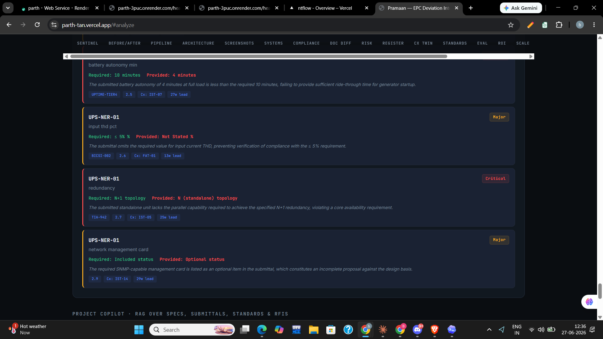

# Real-Document Result — Live LLM Analysis

**Proof that Pramaan works on a genuine third-party document it has never seen.**

On 2026-06-27 the deployed app analysed a **real Vertiv Liebert GXT MT UPS
datasheet** (downloaded from vertiv.com, 270 KB PDF) against the edge data-centre
design basis (`design_basis_edge.pdf`). Running live in `llm mode`
(`gemini-2.5-pro`), it recovered **8 genuine deviations** — nothing in this pair
came from the seeded corpus.

| # | Component | Parameter | Required | Provided | Severity | Standard | Cx test | Lead |
|---|-----------|-----------|----------|----------|----------|----------|---------|------|
| 1 | UPS-NER-01 | rated capacity (kVA) | 6 kVA | **3 kVA** | Critical | DB 2.2 | FAT-01 | 13w |
| 2 | UPS-NER-01 | rated capacity (kW) | 6 kW | **2.4 kW** | Critical | DB 2.2 | FAT-01 | 13w |
| 3 | UPS-NER-01 | output power factor | ≥ 0.9 | **0.8** | Major | DB 2.3 | FAT-01 | 13w |
| 4 | UPS-NER-01 | online efficiency @100% | 96% | **88%** | Major | BICSI-002 / 2.4 | FAT-01 | 13w |
| 5 | UPS-NER-01 | battery autonomy | 10 min | **4 min** | Critical | UPTIME-TIER4 / 2.5 | IST-07 | 27w |
| 6 | UPS-NER-01 | input THD | ≤ 5% | **Not Stated** | Major | BICSI-002 / 2.6 | FAT-01 | 13w |
| 7 | UPS-NER-01 | redundancy | N+1 | **N (standalone)** | Critical | TIA-942 / 2.7 | IST-05 | 25w |
| 8 | UPS-NER-01 | network management card | Included | **Optional** | Major | DB 2.9 | IST-14 | 29w |

## Screenshots (live run on the deployed app)

A genuine **before / after** on the same two real PDFs.

**Before — no LLM key (deterministic fallback).** The regex brain can't parse a
real prose datasheet, so it finds nothing — proof the result below is *reasoning*,
not pattern-matching:

**After — `llm mode`.** The model reasons over the same two PDFs and surfaces
8 real deviations with severity, cited standard, commissioning test, and lead time:

## Why this result is impressive (not just a string match)

- **It did arithmetic.** The datasheet states 3 kVA at 0.8 PF; the model derived
  **2.4 kW** real power and flagged it against the 6 kW requirement (#2).
- **It distinguished operating modes.** It flagged **88% online** efficiency
  against the 96% requirement, correctly *not* crediting the higher ECO-mode
  headline figure (#4) — exactly the trap the design basis warned about.
- **It caught an omission, not just a mismatch.** Input THD is simply absent
  from the datasheet; the model flagged the missing value as non-conforming
  evidence (#6).
- **It read intent, not keywords.** The management card is offered as "optional";
  the basis requires it included — flagged as an incomplete proposal (#8).
- Each finding carries a **severity, a cited standard, a predicted commissioning
  test, and a lead-time-to-failure** — the full audit chain, on a document the
  system had never encountered.

## Reproduce it

1. Download a real datasheet (e.g. Vertiv Liebert GXT MT 1–3 kVA).
2. Backend must have an LLM key — check `GET /health` shows `"ready": true`.
3. Live Analysis → Upload PDFs → `design_basis_edge.pdf` as Spec, the datasheet
   as Submittal → Analyze.

> Cost note: `gemini-2.5-pro` is the most thorough but costs more per call. For
> repeated demo runs use `gemini-2.5-flash` (≈10–15× cheaper); the analyze path
> also caps the standards text it sends (~85% fewer tokens) to keep cost low.
